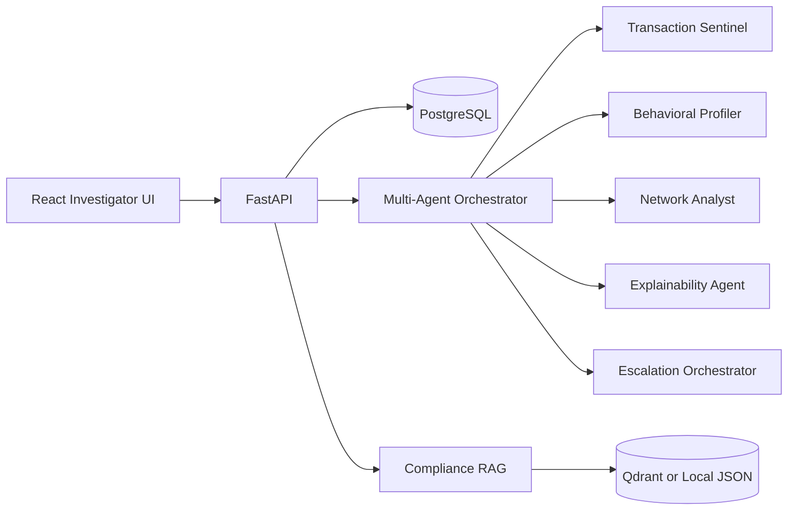

# Architecture

FraudShield AI is organized as a modular fraud operations platform with a clear separation between user experience, orchestration, specialist agent logic, retrieval, and data storage.

## High-Level System

## Core Layers

### Frontend

The React application acts as the fraud operations cockpit. It is responsible for:

- authentication entry flow
- command center dashboards
- live transaction analysis views
- alert triage
- investigator case workflows
- network graph visualization
- compliance and reporting surfaces
- AI copilot interaction

### Backend

The FastAPI service provides the operational interface between the UI and the fraud engine. It is responsible for:

- request validation
- API contracts
- agent orchestration
- dashboard metrics delivery
- case and alert workflows
- SAR draft generation
- explainability responses

### Agent Layer

The agent system is intentionally split into specialist roles rather than one monolithic fraud scorer.

- `Transaction Sentinel`: evaluates transaction-level risk indicators
- `Behavioral Profiler`: compares current activity to expected customer behavior
- `Network Analyst`: identifies shared-device, shared-IP, and ring-style risk
- `Explainability Agent`: translates signals into analyst-readable reasoning
- `Escalation Orchestrator`: turns the combined score into an operational action

### Retrieval Layer

The RAG module supports compliance and evidence-backed assistance. In the current prototype it uses a local chunk store, but the design is ready for a future move to a managed vector database such as Qdrant.

### Data Layer

PostgreSQL is the primary persistence target for:

- users
- transactions
- alerts
- fraud cases
- behavior profiles
- fraud networks
- agent logs
- audit logs

## Design Goals

This architecture was chosen to maximize:

- demo clarity
- modularity
- realistic enterprise structure
- extension into production-oriented services later

It is intentionally prototype-scaled, but the boundaries are laid out to support future evolution into streaming ingestion, richer graph analytics, production retrieval, and stronger compliance workflows.

