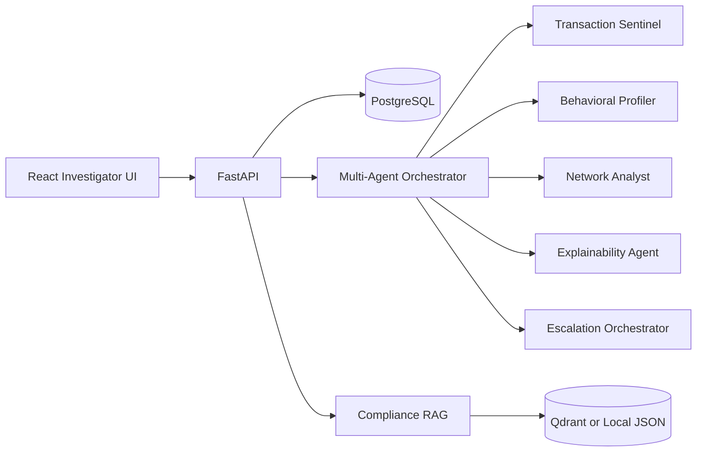

# Architecture

Frontend responsibilities:

- Login, dashboards, live feed, cases, network visualization, reports, AI copilot

Backend responsibilities:

- API contracts, validation, agent orchestration, demo persistence, report generation

Agent responsibilities:

- Independent risk signals
- Human-readable explanations
- Escalation decisions

