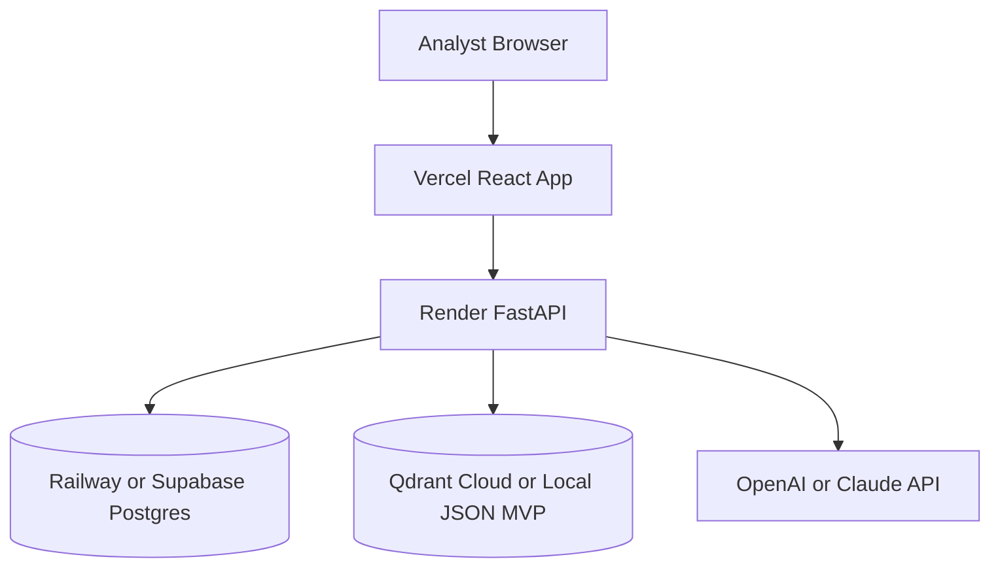

# FraudShield AI Project Blueprint

## Repository Responsibilities

| Folder | Purpose | Key Files |
|---|---|---|
| `frontend` | Analyst-facing enterprise UI | `src/main.tsx`, `src/styles.css` |
| `backend` | FastAPI service and API contracts | `app/main.py`, `app/routes/*`, `app/models.py` |
| `agents` | Multi-agent fraud engine | `transaction_sentinel.py`, `behavioral_profiler.py`, `network_analyst.py`, `explainability_agent.py`, `escalation_orchestrator.py`, `orchestrator.py` |
| `rag` | Compliance retrieval module | `ingest.py`, `chunking.py`, `retriever.py`, `documents/*` |
| `database` | PostgreSQL schema and seed data | `schema.sql`, `seed.sql` |
| `datasets` | Generated synthetic demo data | `README.md`, generated CSVs |
| `scripts` | Data generation utilities | `generate_mock_data.py` |
| `docs` | Submission and engineering docs | `architecture.md`, `api.md`, `demo-flow.md`, `roadmap.md` |
| `deployment` | Hosting configs | `render.yaml`, `vercel.json` |

## MVP Categories

### Category A: Must Build

- Transaction scoring endpoint
- Multi-agent risk signals
- Explainable decision output
- Alert list
- Case creation
- Dashboard stats
- Network graph endpoint
- SAR draft endpoint
- React pages for demo flow
- Synthetic data script

### Category B: Can Simulate

- LLM calls, by deterministic prompt-compatible fallback
- Qdrant, by local JSON retriever
- Streaming, by polling or button-triggered transaction submission
- Authentication, by demo token response
- Graph analytics, by generated network fixture

### Category C: Future Roadmap

- Kafka ingestion
- Real model training and online features
- Neo4j graph detection
- Full LangGraph state machine
- Human approval queues
- Compliance filing integrations

## AI Agents

### Transaction Sentinel

Purpose: score transaction-level risk.

Input: transaction amount, merchant, country, channel, device, IP.

Output: `score`, `label`, `reasons`.

Pseudo code:

```text
score = base
if amount is high: add risk
if country is risky: add risk
if channel is remote: add risk
if merchant suggests rapid value movement: add risk
return signal
```

Implementation: `agents/transaction_sentinel.py`

### Behavioral Profiler

Purpose: compare event to customer's normal behavior.

Input: transaction and behavioral profile fields.

Output: anomaly score and behavioral reasons.

Implementation: `agents/behavioral_profiler.py`

### Network Analyst

Purpose: detect mule accounts, shared devices, risky IPs, and ring patterns.

Input: account, device, IP, beneficiary relationships.

Output: network risk score and graph reasons.

Implementation: `agents/network_analyst.py`

### Explainability Agent

Purpose: convert agent signals into investigator-ready explanation.

Input: transaction, risk score, agent signals.

Output: natural-language explanation, top drivers, counterfactual, next actions.

Implementation: `agents/explainability_agent.py`

### Escalation Orchestrator

Purpose: choose approve, step-up auth, hold, or block/escalate.

Input: final risk score.

Output: decision and workflow actions.

Implementation: `agents/escalation_orchestrator.py`

## Backend API Design

| Endpoint | Method | Purpose |
|---|---|---|
| `/auth/login` | POST | Demo analyst login |
| `/transaction/analyze` | POST | Run multi-agent risk analysis |
| `/alerts` | GET | List fraud alerts |
| `/case/create` | POST | Create investigation case |
| `/dashboard/stats` | GET | Dashboard metrics, trends, heatmap |
| `/agent/explain` | POST | Explain risk decision |
| `/network/{account_id}` | GET | Return fraud network graph |
| `/reports/sar` | POST | Generate SAR draft |

Validation is handled with Pydantic models in `backend/app/models.py`. Errors use FastAPI `HTTPException`.

## Frontend Pages

### Login

Layout: centered brand panel.

Interaction: demo login button calls `/auth/login`.

### Dashboard

Layout: metric cards, risk trend, agent activity, heatmap, live feed.

API: `/dashboard/stats`.

### Live Transactions

Layout: normal/fraud transaction buttons and result panel.

API: `/transaction/analyze`.

### Fraud Alerts

Layout: alert cards by severity and status.

API: `/alerts`.

### Investigator Workbench

Layout: case creation and evidence area.

API: `/case/create`.

### Fraud Network Graph

Layout: visual node cluster plus relationship list.

API: `/network/ACC-1044`.

### Compliance Reports

Layout: SAR generation button and JSON draft preview.

API: `/reports/sar`.

### AI Copilot

Layout: analyst Q&A panel.

MVP: deterministic answer for judging. Future: connect to `/agent/explain` and RAG retrieval.

## Deployment Architecture



## GitHub Structure

Use this repository root directly:

```text
fraudshield-ai/
  frontend/
  backend/
  agents/
  rag/
  database/
  datasets/
  docs/
  scripts/
  deployment/
  README.md
```

Recommended branches:

- `main`: demo-stable
- `feat/frontend-polish`: UI improvements
- `feat/agent-logic`: scoring improvements
- `feat/deployment`: hosting setup

