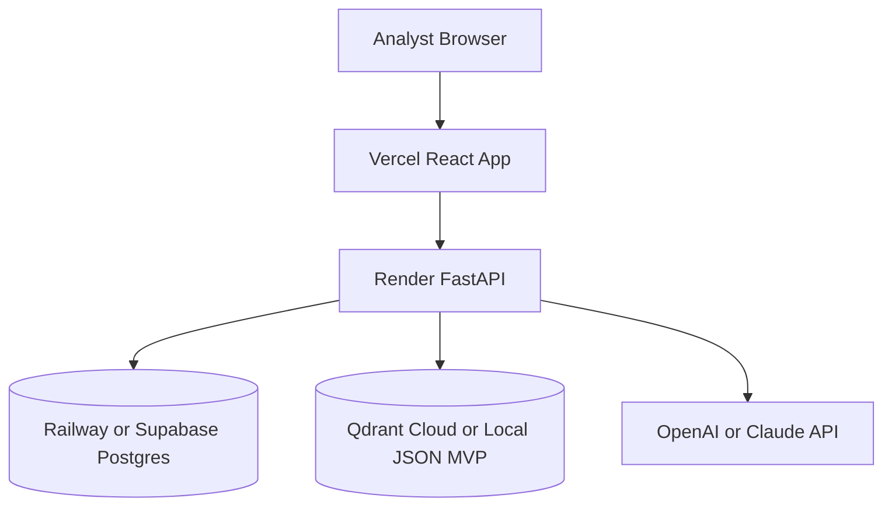

# Project Blueprint

This document summarizes the intended shape of FraudShield AI as a product, codebase, and demo system.

It is useful when you want a single document that explains what the repository contains and how the main pieces fit together.

## Repository Responsibilities

| Folder | Purpose | Key Files |
|---|---|---|
| `frontend` | Analyst-facing fraud operations UI | `src/main.tsx`, `src/styles.css`, `run-dev.cmd` |
| `backend` | FastAPI service and API layer | `app/main.py`, `app/routes/*`, `app/models.py` |
| `agents` | Specialist fraud intelligence logic | `transaction_sentinel.py`, `behavioral_profiler.py`, `network_analyst.py`, `explainability_agent.py`, `escalation_orchestrator.py`, `orchestrator.py` |
| `rag` | Compliance and evidence retrieval | `ingest.py`, `chunking.py`, `retriever.py`, `documents/*` |
| `database` | Relational schema and seed data | `schema.sql`, `seed.sql` |
| `datasets` | Synthetic fraud demo data | `README.md`, generated CSVs |
| `scripts` | Utility scripts and demo helpers | `generate_mock_data.py`, `demo-api.mjs` |
| `docs` | Public documentation and submission support | `architecture.md`, `api.md`, `demo-flow.md`, `roadmap.md` |
| `deployment` | Deployment config targets | `render.yaml`, `vercel.json` |

## Product Model

FraudShield AI is organized around a simple but expressive product model:

1. ingest or simulate a transaction
2. analyze it through multiple specialist agents
3. explain the result in plain investigator language
4. visualize supporting network evidence
5. escalate into an analyst workflow
6. support compliance reporting

## Agent Roles

### Transaction Sentinel

Evaluates transaction-level fraud indicators such as amount, country, channel, merchant type, and remote-payment risk.

### Behavioral Profiler

Compares current activity against expected customer patterns and flags deviations such as unusual amount, timing, or device context.

### Network Analyst

Looks for shared devices, suspicious IP reuse, linked accounts, and ring-like fraud behavior.

### Explainability Agent

Turns agent signals into a concise narrative that an investigator can understand quickly.

### Escalation Orchestrator

Maps aggregate risk into a practical action such as approve, step up, hold for review, or block and escalate.

## Backend Surface

The primary backend endpoints are:

- `/auth/login`
- `/transaction/analyze`
- `/alerts`
- `/case/create`
- `/dashboard/stats`
- `/agent/explain`
- `/network/{account_id}`
- `/reports/sar`

## Frontend Experience

The UI is designed as an enterprise fraud command center rather than a generic demo dashboard.

It currently includes:

- a branded landing screen
- a command-center dashboard
- live transaction decision traces
- alert queue and severity views
- an investigator workbench
- a fraud ring graph
- compliance reporting surfaces
- an AI copilot panel

## Prototype Boundaries

The current repository intentionally optimizes for:

- strong demo impact
- clear product storytelling
- realistic system boundaries
- ease of local exploration

It intentionally does not yet optimize for:

- hardened authentication
- production-scale persistence
- real-time streaming infrastructure
- advanced graph databases
- regulated deployment controls

## Deployment Shape

## Best Use Of This Document

Use this blueprint when you need:

- a quick architecture orientation
- a repo overview for collaborators
- a submission-support summary
- a handoff document for future expansion

